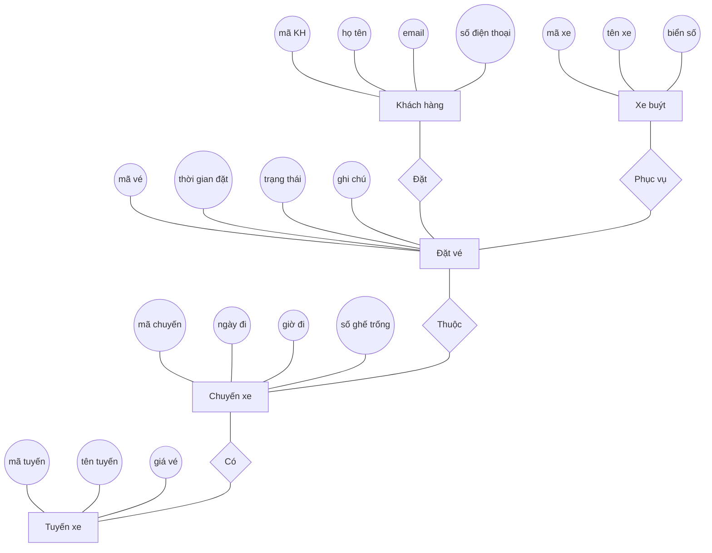
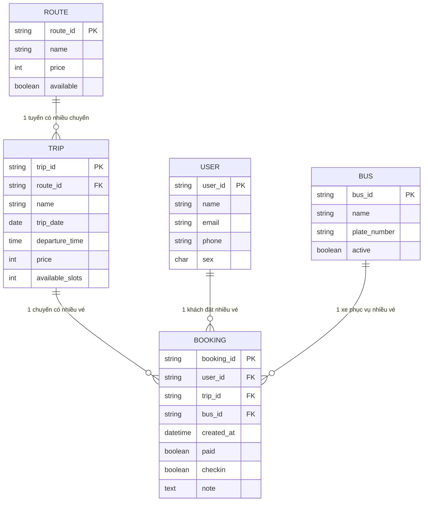

# BÁO CÁO THIẾT KẾ CƠ SỞ DỮ LIỆU
## Đề tài: Hệ thống quản lý đặt vé xe buýt HolaBus

**Môn học:** Cơ sở dữ liệu  
**Nhóm:** [Tên nhóm]  
**Thành viên:** [Danh sách thành viên]

---

## 1. Yêu Cầu Bài Toán

### 1.1. Mô tả hệ thống

HolaBus là hệ thống đặt vé xe buýt giúp sinh viên FPT đặt vé đi về các tỉnh trong dịp lễ Tết.

### 1.2. Các chức năng chính

| STT | Chức năng | Mô tả |
|-----|-----------|-------|
| 1 | Quản lý tuyến xe | Thêm, sửa, xóa các tuyến xe (Hải Phòng, Quảng Ninh...) |
| 2 | Quản lý chuyến xe | Tạo chuyến xe với ngày, giờ, giá vé |
| 3 | Đặt vé | Khách hàng điền thông tin và đặt vé |
| 4 | Thanh toán | Xác nhận thanh toán cho đơn đặt vé |
| 5 | Check-in | Điểm danh hành khách khi lên xe |
| 6 | Tra cứu vé | Xem thông tin vé đã đặt |

### 1.3. Các đối tượng cần quản lý

- **Tuyến xe (Route):** Thông tin các tuyến đường (tên, giá, điểm dừng)
- **Chuyến xe (Trip):** Các chuyến cụ thể theo ngày/giờ
- **Khách hàng (User):** Thông tin người đặt vé
- **Đặt vé (Booking):** Thông tin đơn đặt vé
- **Xe buýt (Bus):** Thông tin xe phục vụ

---

## 2. Thiết Kế ERD

### 2.1. Xác định thực thể và thuộc tính

#### Thực thể 1: ROUTE (Tuyến xe)
| Thuộc tính | Mô tả | Ghi chú |
|------------|-------|---------|
| route_id | Mã tuyến | Khóa chính |
| name | Tên tuyến | VD: "Quảng Ninh" |
| price | Giá vé | VD: 209000 |
| available | Đang mở bán | TRUE/FALSE |

#### Thực thể 2: TRIP (Chuyến xe)
| Thuộc tính | Mô tả | Ghi chú |
|------------|-------|---------|
| trip_id | Mã chuyến | Khóa chính |
| route_id | Mã tuyến | Khóa ngoại → ROUTE |
| name | Tên chuyến | VD: "FPT - Quảng Ninh" |
| trip_date | Ngày đi | VD: 22/01/2025 |
| departure_time | Giờ xuất phát | VD: 09:30 |
| price | Giá vé | Có thể khác giá tuyến |
| available_slots | Số ghế còn | VD: 29 |

#### Thực thể 3: USER (Khách hàng)
| Thuộc tính | Mô tả | Ghi chú |
|------------|-------|---------|
| user_id | Mã khách hàng | Khóa chính |
| name | Họ tên | |
| email | Email | |
| phone | Số điện thoại | |
| sex | Giới tính | 1=Nam, 2=Nữ |

#### Thực thể 4: BOOKING (Đặt vé)
| Thuộc tính | Mô tả | Ghi chú |
|------------|-------|---------|
| booking_id | Mã vé | Khóa chính |
| user_id | Mã khách hàng | Khóa ngoại → USER |
| trip_id | Mã chuyến | Khóa ngoại → TRIP |
| created_at | Thời gian đặt | |
| paid | Đã thanh toán | TRUE/FALSE |
| checkin | Đã check-in | TRUE/FALSE |
| note | Ghi chú | |

#### Thực thể 5: BUS (Xe buýt)
| Thuộc tính | Mô tả | Ghi chú |
|------------|-------|---------|
| bus_id | Mã xe | Khóa chính |
| name | Tên xe | VD: "Hải Dương - Hải Phòng" |
| plate_number | Biển số | |
| active | Đang hoạt động | TRUE/FALSE |

### 2.2. Xác định mối quan hệ

| Thực thể 1 | Quan hệ | Thực thể 2 | Loại |
|------------|---------|------------|------|
| ROUTE | có | TRIP | 1 - N |
| TRIP | có | BOOKING | 1 - N |
| USER | đặt | BOOKING | 1 - N |
| BUS | phục vụ | BOOKING | 1 - N |

**Giải thích:**
- Một **tuyến xe** có nhiều **chuyến xe** (1 tuyến Quảng Ninh có nhiều chuyến trong ngày)
- Một **chuyến xe** có nhiều **đơn đặt vé** (1 chuyến có nhiều khách đặt)
- Một **khách hàng** có thể đặt nhiều **vé** (1 người đặt nhiều vé)
- Một **xe buýt** phục vụ nhiều **đơn đặt vé**

### 2.3. Sơ đồ ERD (Dạng truyền thống - Chen Notation)

Dưới đây là sơ đồ ERD theo phong cách truyền thống (Thực thể - Hình chữ nhật, Thuộc tính - Hình oval, Mối quan hệ - Hình thoi) như giảng viên hướng dẫn:



### 2.4. Sơ đồ ERD (Dạng Crow's Foot - Hiện đại)
 (Sơ đồ này chi tiết hơn về kiểu dữ liệu và khóa chính/khóa ngoại)



---

## 3. Chuyển Thành Database Schema

### 3.1. Bảng ROUTE
```sql
CREATE TABLE route (
    route_id VARCHAR(20) PRIMARY KEY,
    name VARCHAR(100) NOT NULL,
    price INT NOT NULL,
    available BOOLEAN DEFAULT FALSE
);
```

### 3.2. Bảng BUS
```sql
CREATE TABLE bus (
    bus_id VARCHAR(20) PRIMARY KEY,
    name VARCHAR(100) NOT NULL,
    plate_number VARCHAR(20),
    active BOOLEAN DEFAULT TRUE
);
```

### 3.3. Bảng TRIP
```sql
CREATE TABLE trip (
    trip_id VARCHAR(20) PRIMARY KEY,
    route_id VARCHAR(20) NOT NULL,
    name VARCHAR(100) NOT NULL,
    trip_date DATE NOT NULL,
    departure_time TIME NOT NULL,
    price INT NOT NULL,
    available_slots INT DEFAULT 29,
    FOREIGN KEY (route_id) REFERENCES route(route_id)
);
```

### 3.4. Bảng USER
```sql
CREATE TABLE user (
    user_id VARCHAR(20) PRIMARY KEY,
    name VARCHAR(100) NOT NULL,
    email VARCHAR(100) NOT NULL,
    phone VARCHAR(15) NOT NULL,
    sex CHAR(1) NOT NULL
);
```

### 3.5. Bảng BOOKING
```sql
CREATE TABLE booking (
    booking_id VARCHAR(10) PRIMARY KEY,
    user_id VARCHAR(20) NOT NULL,
    trip_id VARCHAR(20) NOT NULL,
    bus_id VARCHAR(20),
    created_at DATETIME DEFAULT CURRENT_TIMESTAMP,
    paid BOOLEAN DEFAULT FALSE,
    checkin BOOLEAN DEFAULT FALSE,
    note TEXT,
    FOREIGN KEY (user_id) REFERENCES user(user_id),
    FOREIGN KEY (trip_id) REFERENCES trip(trip_id),
    FOREIGN KEY (bus_id) REFERENCES bus(bus_id)
);
```

---

## Tổng kết

| STT | Thực thể | Thuộc tính | Quan hệ |
|-----|----------|------------|---------|
| 1 | ROUTE | 4 | 1:N với TRIP |
| 2 | BUS | 4 | 1:N với BOOKING |
| 3 | TRIP | 7 | 1:N với BOOKING |
| 4 | USER | 5 | 1:N với BOOKING |
| 5 | BOOKING | 8 | N:1 với USER, TRIP, BUS |

**Tổng số thực thể:** 5  
**Tổng số mối quan hệ:** 4

---

> Báo cáo được tạo dựa trên dự án HolaBus - Hệ thống đặt vé xe buýt cho sinh viên FPT
